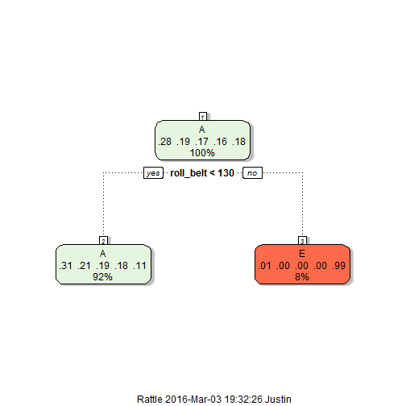
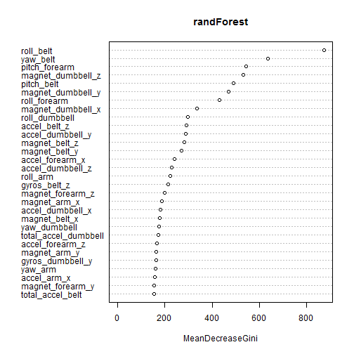
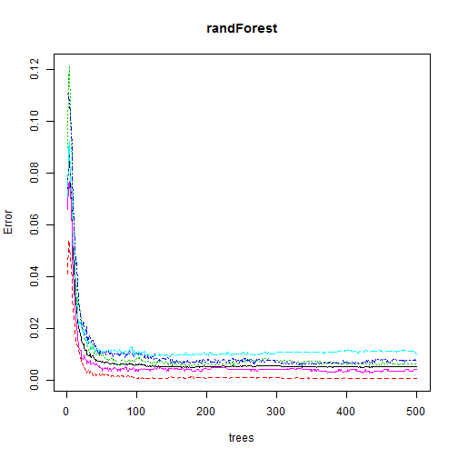

# Predicting the Classe Variable in the Weight Lifting Exercise Dataset

## Synopsis

"Using devices such as Jawbone Up, Nike FuelBand, and Fitbit it is now possible to collect a large amount of data about personal activity relatively inexpensively. These type of devices are part of the quantified self movement - a group of enthusiasts who take measurements about themselves regularly to improve their health, to find patterns in their behavior, or because they are tech geeks. One thing that people regularly do is quantify how much of a particular activity they do, but they rarely quantify how well they do it. In this project, your goal will be to use data from accelerometers on the belt, forearm, arm, and dumbell of 6 participants. They were asked to perform barbell lifts correctly and incorrectly in 5 different ways."

The variable CLASSE in the dataset tells us whether or not the activity was performed correctly or not. The values are the letters A,B,C,D and E. 'A' indicates that the excercise was performed correctly and the other letters indicate it was not performed correctly. The goal of this assignment is to build a model that can accurately depict, given the other variables, how the excercise was performed. With my model I should be able to tell you with a certain degree of accuracy what type of workout was performed by the individual, given predictor variables.

For prediction I first used the decision tree prediction method. This only gave me an accuracy percentage of 49.4%. I then tried the random forrest method of prediction. This method is well know for being very accurate and is popular as a result. With RF I was able to achieve an accuracy percentage of over 99%.

## DATA PROCESSING

The first step in conducting the analysis was loading the required packages, loading the datasets and setting the seed. I set the seed to 777. When loading in the data, I make r recognize when the data point is na using na.strings. The data is na when the values are "NA" or "#DIV/0!" (a common excel error).


```r
set.seed(777)
library(caret); library(ISLR); library(randomForest); library(rattle); library(ggplot2); library(rpart); library(rpart.plot)
```

The next step is to load the data, here I use the read.csv function.


```r
urlTrain <- "https://d396qusza40orc.cloudfront.net/predmachlearn/pml-training.csv"
urlTest <- "https://d396qusza40orc.cloudfront.net/predmachlearn/pml-testing.csv"
rawTrain <- read.csv(url(urlTrain), na.strings=c("NA","#DIV/0!",""))
rawTest <- read.csv(url(urlTest), na.strings=c("NA","#DIV/0!",""))
```

The next step in my analysis was removing the non-zero variance predictors, null columns and categorical variables. I finished preparing the data by converting the classe variable to a factor variable.


```r
nzvTrain <- nearZeroVar(rawTrain, saveMetrics = TRUE)
rawTrain1 <- rawTrain[,nzvTrain$nzv == FALSE]
rawTrain2 <- rawTrain1[, colSums(is.na(rawTrain1)) == 0]
rawTrain2 <- rawTrain2[,7:59]
rawTrain2$classe <- as.factor(rawTrain2$classe)
```

Now to split the data into a training set and a validation set. A test set has already been set aside. I split 70% training, 30% validation.

```r
inTrain <- createDataPartition(y = rawTrain2$classe, p = .7, list = FALSE)
training <- rawTrain2[inTrain,]
valid <- rawTrain2[-inTrain,]
```

##Prediction attempt with a decision tree model

I use the train function from caret to create the model. I set the method to rpart. I create the model using classe as the dependent variable and the remaining other variables as the independent variables. I then use fancyRpartPlot to see the results of the model.

```r
modFit <- train(classe ~ . , method = "rpart", data = training)
fancyRpartPlot(modFit$finalModel)
```

 

From this decision tree we see how the model will predict variables given values of certain variables deemed to be predictors. 
If roll_belt is greater than 130, the value predicted is 'E'
If roll_belt is less than 130 AND pitch forearm is less than -34, the value predicted is 'A' (the excercise has been performed correctly)
If roll_belt is less than 130, pitch forearm is greater than -34 AND magnet dumbell y is greater than 440, the value predicted is 'B'.
If roll_belt is less than 130, pitch forearm is greater than -34 AND magnet dumbell y is less than 440 AND roll forearm is less than 122, the predicted value is 'A' (the excercise has been performed correctly).
If roll_belt is less than 130, pitch forearm is greater than -34 AND magnet dumbell y is less than 440 AND roll forearm is greater than 122, the predicted value is 'C'
Note that the decision tree does not predict D in any case. This is a cause for concern and already we can see that this method may not yeild high accuracy.

We now bring in the validation data and attempt to predict with the model. Using a confusion matrix, we can analyze the accuracy of the model.


```r
pr <- predict(modFit, newdata = valid)
confusionMatrix(pr, valid$classe)
```

```
## Confusion Matrix and Statistics
## 
##           Reference
## Prediction    A    B    C    D    E
##          A 1670 1139 1026  964  604
##          B    0    0    0    0    0
##          C    0    0    0    0    0
##          D    0    0    0    0    0
##          E    4    0    0    0  478
## 
## Overall Statistics
##                                           
##                Accuracy : 0.365           
##                  95% CI : (0.3527, 0.3774)
##     No Information Rate : 0.2845          
##     P-Value [Acc > NIR] : < 2.2e-16       
##                                           
##                   Kappa : 0.1227          
##  Mcnemar's Test P-Value : NA              
## 
## Statistics by Class:
## 
##                      Class: A Class: B Class: C Class: D Class: E
## Sensitivity            0.9976   0.0000   0.0000   0.0000  0.44177
## Specificity            0.1135   1.0000   1.0000   1.0000  0.99917
## Pos Pred Value         0.3091      NaN      NaN      NaN  0.99170
## Neg Pred Value         0.9917   0.8065   0.8257   0.8362  0.88821
## Prevalence             0.2845   0.1935   0.1743   0.1638  0.18386
## Detection Rate         0.2838   0.0000   0.0000   0.0000  0.08122
## Detection Prevalence   0.9181   0.0000   0.0000   0.0000  0.08190
## Balanced Accuracy      0.5556   0.5000   0.5000   0.5000  0.72047
```

We can see from this output that the accuracy is a low 49%. This is unsuprising given the desision tree above. No D's were predicted by the model. So for class D we find a sensitivity of 0 and a positive predictive value of Nan.

From here I decided to try a random forrest model as it is known to be highly accurate despite being slow and potentially overfitting.

##Prediction attempt with a random forrest model

I will now build a model using the randomForest function from the randomForest package loaded earlier. I then run a variable importance plot, a "dotchart of variable importance as measured by a Random Forest". 


```r
randForest = randomForest(classe~., data=training)
varImpPlot(randForest)
```

 

We can see that the model, as with the decision tree, states that roll_belt has the most variable importance. 
I will now introduce the validation data set and generate a confusion matrix.


```r
prediction <- predict(randForest, valid, type = "class")
confusionMatrix(prediction, valid$classe)
```

```
## Confusion Matrix and Statistics
## 
##           Reference
## Prediction    A    B    C    D    E
##          A 1672    9    0    0    0
##          B    0 1126    3    0    0
##          C    2    4 1023   10    2
##          D    0    0    0  954    4
##          E    0    0    0    0 1076
## 
## Overall Statistics
##                                          
##                Accuracy : 0.9942         
##                  95% CI : (0.9919, 0.996)
##     No Information Rate : 0.2845         
##     P-Value [Acc > NIR] : < 2.2e-16      
##                                          
##                   Kappa : 0.9927         
##  Mcnemar's Test P-Value : NA             
## 
## Statistics by Class:
## 
##                      Class: A Class: B Class: C Class: D Class: E
## Sensitivity            0.9988   0.9886   0.9971   0.9896   0.9945
## Specificity            0.9979   0.9994   0.9963   0.9992   1.0000
## Pos Pred Value         0.9946   0.9973   0.9827   0.9958   1.0000
## Neg Pred Value         0.9995   0.9973   0.9994   0.9980   0.9988
## Prevalence             0.2845   0.1935   0.1743   0.1638   0.1839
## Detection Rate         0.2841   0.1913   0.1738   0.1621   0.1828
## Detection Prevalence   0.2856   0.1918   0.1769   0.1628   0.1828
## Balanced Accuracy      0.9983   0.9940   0.9967   0.9944   0.9972
```

This model appears to have an accuracy of prediction of 99.39%. 

##Out-of-sample error rates
###For the decision tree model:
With an accuracy of .4948, we can estimate that the out-of-sample error rate is .5052, or 50.52%.

###For the random forrest model:
With an accuracy of .9939, we can estimate that the out-of-sample error rate is .0061, or 0.61%


```r
plot(randForest)
```

 

We can see that as the number of trees increases the error rate drops to basically nothing, this is in line with the near zero estimate for the out-of-sample error.

##Predicting the test set values

I will now take the test data and predict the classe variable for all 20 of the records:


```r
predict(randForest, rawTest, type = "class")
```

```
##  1  2  3  4  5  6  7  8  9 10 11 12 13 14 15 16 17 18 19 20 
##  B  A  B  A  A  E  D  B  A  A  B  C  B  A  E  E  A  B  B  B 
## Levels: A B C D E
```

